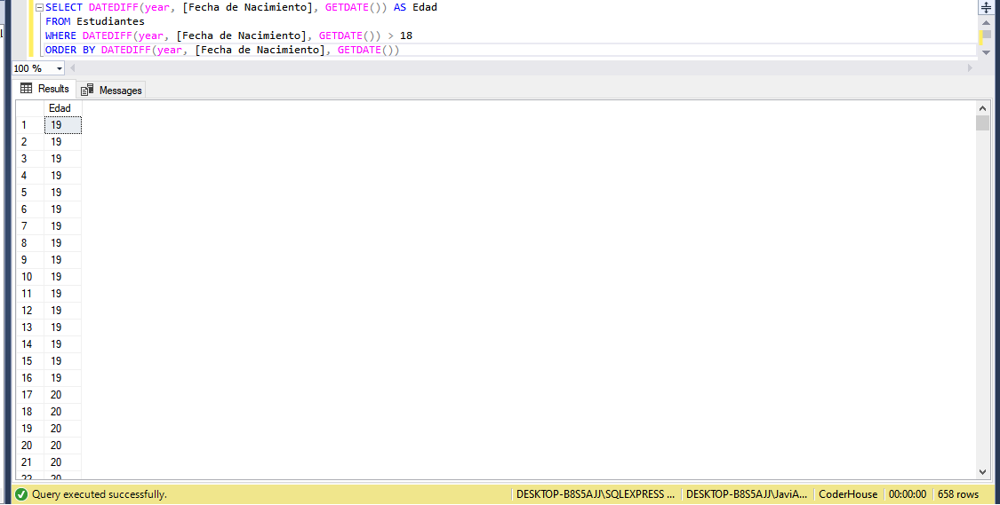
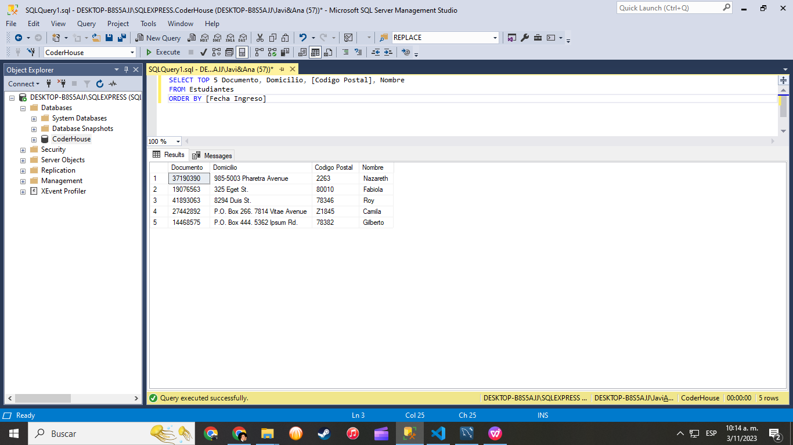

# 👨‍🎓Coderhouse students queries 👨‍🎓
## 👩‍💻Software: 
SQL SERVER MANAGEMENT STUDIO
## 📔Database: 
CoderHouse(3).bak consist in 6 tables, named in Spanish: Area, Asignaturas, Encargado, Estudiantes, Profesiones, Staff.

### 1. Indicate how many courses and careers the Data area has. Rename the new column as cant_assignatures.
First I need to check the ID of the Data area
 ```sql
SELECT * FROM Area
```


Now I can do the count of courses and careers
```sql
SELECT COUNT(Area) AS cant_assignatures  
FROM Asignaturas 
WHERE Area = 5

```


### 2. What is the name, identification document and telephone number of students who are professionals in agronomy and who were born between 1970 and 2000?.

```sql
SELECT Nombre, Documento, Telefono, Profesion, [Fecha de Nacimiento]
FROM Estudiantes
WHERE (Profesion = (
					SELECT ProfesionesID FROM Profesiones 
					WHERE (Profesiones = 'Agronomo Agronoma') AND
		[Fecha de Nacimiento] BETWEEN '1970-01-01' AND '2000-01-01'
					)
		)
```


### 3. List the teachers who joined in 2021 and concatenate the first and last name fields with a hyphen (-). Example: Elba-Jimenez. Rename the new column  Nombres_Apellidos. The results in the new column must be in uppercase.
```sql
SELECT UPPER (CONCAT_WS ('-', Nombre, Apellido)) AS Nombres_Apellidos 
FROM Staff WHERE [Fecha Ingreso] BETWEEN '2021-01-01' AND '2021-12-31'
```


### 4. Indicate the number of teachers and tutors in charge. Rename the column to CantEncargados. Remove the word Manager in each of the records. Rename the column as NuevoTipo.
```sql
SELECT COUNT(Encargado_ID) AS  CantEncargados FROM Encargado
```


```sql
UPDATE Encargado SET [Tipo] = REPLACE('Encargado Docente', 'Encargado', '')
```

### 5. Indicate the average price of the carreers and courses per day. Rename the new column Average. Order the averages from Highest to Lowest.
Como hago para poner nombre a las filas ????
```sql
SELECT AVG(Costo) AS Promedio FROM Asignaturas GROUP BY Tipo ORDER BY Tipo
```

### 6. Calculate the age of the students in a new column. Rename the new column Edad. Filter only those who are over 18 years old. Sort from Lowest to Highest

```sql
SELECT DATEDIFF(year, [Fecha de Nacimiento], GETDATE()) AS Edad 
FROM Estudiantes 
WHERE DATEDIFF(year, [Fecha de Nacimiento], GETDATE()) >= 18
ORDER BY DATEDIFF(year, [Fecha de Nacimiento], GETDATE()) 
```


### 7. List the Name, email, class and date of entry of staff members who contain ".edu" email and their TeacherID is greater than or equal to 100
```sql
SELECT Nombre, Correo, [Fecha Ingreso], Camada FROM Staff
WHERE DocentesID> 100 AND (RIGHT(Correo, 4)) = '.edu'
```


### 8. It is required to know the document, address, zip code and name of the first students who registered on the platform
```sql
SELECT TOP 5 Documento, Domicilio, [Codigo Postal], Nombre
FROM Estudiantes
ORDER BY [Fecha Ingreso]
```


### 9. Indicate the name, surname and identification document of the teachers and tutors who have UX subjects
```sql
SELECT Nombre, Apellido, Documento FROM Staff 
WHERE Asignatura IN (
	SELECT AsignaturasID FROM Asignaturas WHERE Nombre LIKE '%UX%'
					)
 ```
 
### 10. Calculate the 25% increase for the subjects in the marketing area for the morning shift, all the fields must be brought, The new cost must be in decimal with 3 digits. Rename the percentage calculation to Porcentaje and the sum of the cost plus the percentage to NuevoCosto
```sql
SELECT AsignaturasID, 
		Nombre,		
		Tipo, 
		Jornada, 
		Costo, 
		Area, 
		CAST((Costo*0.25) AS DECIMAL (10,3)) AS Porcentaje,
		CAST((Costo * 1.25) AS DECIMAL(10,3)) AS NuevoCosto 
FROM Asignaturas WHERE Jornada = 'Manana'
```
