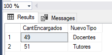
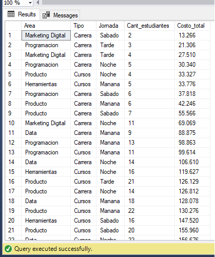

# 👨‍🎓Coderhouse students queries 👨‍🎓
## 👩‍💻Software: 
SQL SERVER MANAGEMENT STUDIO
## 📔Database: 
CoderHouse(3).bak consist in 6 tables, named in Spanish: "Area", "Asignaturas", "Encargado", "Estudiantes", "Profesiones", "Staff". All data is in Spanish.

- Entity relationship diagram


### 1. Indicate how many courses and careers the Data area has. Rename the new column as cant_assignatures.
First I need to check the ID of the Data area
 ```sql
SELECT * FROM Area
```


Now I can do the count of courses and careers
```sql
SELECT COUNT(Area) AS cant_assignatures  
FROM Asignaturas 
WHERE Area = 5

```


### 2. What is the name, identification document and telephone number of students who are professionals in agronomy and who were born between 1970 and 2000?.

```sql
SELECT Nombre, Documento, Telefono, Profesion, [Fecha de Nacimiento]
FROM Estudiantes
WHERE (Profesion = (
					SELECT ProfesionesID FROM Profesiones 
					WHERE (Profesiones = 'Agronomo Agronoma') AND
		[Fecha de Nacimiento] BETWEEN '1970-01-01' AND '2000-01-01'
					)
		)
```


### 3. List the teachers who joined in 2021 and concatenate the first and last name fields with a hyphen (-). Example: Elba-Jimenez. Rename the new column  Nombres_Apellidos. The results in the new column must be in uppercase.
```sql
SELECT UPPER (CONCAT_WS ('-', Nombre, Apellido)) AS Nombres_Apellidos 
FROM Staff WHERE [Fecha Ingreso] BETWEEN '2021-01-01' AND '2021-12-31'
```


### 4. Indicate the number of teachers and tutors in charge. Rename the column to CantEncargados. Remove the word Manager in each of the records. Rename the column as NuevoTipo.
```sql

/*Need to update database because [Encargado_ID]=100 is read differently*/
update [dbo].[Encargado]
set tipo= 'Encargado Tutores'
where trim(Tipo) like '%Tutores%'

SELECT COUNT(Encargado_ID) AS CantEncargados, TRIM('Encargado' FROM Tipo) AS NuevoTipo
FROM Encargado
GROUP BY Tipo
```


### 5. Indicate the average price of the carreers and courses per day. Rename the new column "Promedio". Order the averages from Highest to Lowest.

```sql
SELECT AVG(Costo) AS Promedio, Tipo FROM Asignaturas GROUP BY Tipo ORDER BY Tipo
```


### 6. Calculate the age of the students in a new column. Rename the new column Edad. Filter only those who are over 18 years old. Sort from Lowest to Highest

```sql
SELECT DATEDIFF(year, [Fecha de Nacimiento], GETDATE()) AS Edad 
FROM Estudiantes 
WHERE DATEDIFF(year, [Fecha de Nacimiento], GETDATE()) >= 18
ORDER BY DATEDIFF(year, [Fecha de Nacimiento], GETDATE()) 
```


### 7. List the Name, email, class and date of entry of staff members who contain ".edu" email and their TeacherID is greater than or equal to 100
```sql
SELECT Nombre, Correo, [Fecha Ingreso], Camada FROM Staff
WHERE DocentesID> 100 AND (RIGHT(Correo, 4)) = '.edu'
```


### 8. It is required to know the document, address, zip code and name of the first students who registered on the platform
```sql
SELECT TOP 5 Documento, Domicilio, [Codigo Postal], Nombre
FROM Estudiantes
ORDER BY [Fecha Ingreso]
```


### 9. Indicate the name, surname and identification document of the teachers and tutors who have UX subjects
```sql
SELECT Nombre, Apellido, Documento FROM Staff 
WHERE Asignatura IN (
	SELECT AsignaturasID FROM Asignaturas WHERE Nombre LIKE '%UX%'
					)
 ```
 
### 10. Calculate the 25% increase for the subjects in the marketing area for the morning shift, all the fields must be brought, The new cost must be in decimal with 3 digits. Rename the percentage calculation to Porcentaje and the sum of the cost plus the percentage to NuevoCosto
```sql
SELECT AsignaturasID, 
		Nombre,		
		Tipo, 
		Jornada, 
		Costo, 
		Area, 
		CAST((Costo*0.25) AS DECIMAL (10,3)) AS Porcentaje,
		CAST((Costo * 1.25) AS DECIMAL(10,3)) AS NuevoCosto 
FROM Asignaturas WHERE Jornada = 'Manana'
```


### 11. Only for web development asignatures, indicate the number of teachers who teach by shift and add the costs. The result must contain all the fields of the first table. Rename the column for calculating the number of teachers as cant_teachers and the column for the sum of costs as suma_total

```sql
SELECT	COUNT (DocentesID) AS cant_docentes, 
		Jornada, 
		SUM (Costo) AS suma_total
FROM Asignaturas as A LEFT JOIN Staff ON AsignaturasID = Asignatura
WHERE A.Nombre Like '%Web%'
GROUP BY Jornada
```


### 12. List the ID, name, last name and how many teachers are assigned to each person in charge. Then filter the managers who have a result of 0 since they are the managers who DO NOT have a teacher assigned. Rename the operation field as Cant_Docentes.

```sql
SELECT Encargado_ID, E.Nombre, E.Apellido, COUNT(DocentesID) AS Cant_Docentes
FROM Encargado AS E LEFT JOIN Staff AS S
ON Encargado_ID = Encargado
GROUP BY Encargado_ID, E.Nombre, E.Apellido --Columns with no aggregation must be group by
HAVING COUNT(DocentesID) = 0 -- The WHERE clause is for existing fields and the HAVING clause is applied to the rows in the result set. 
```


### 13. List all the data for subjects that do not have an assigned teacher. The query model must start from the teachers table. 
```sql
SELECT AsignaturasID, A.Nombre, A.Tipo, A.Jornada, A.Costo
FROM Staff AS S RIGHT JOIN Asignaturas AS A  
ON Asignatura = AsignaturasID
GROUP BY AsignaturasID, A.Nombre, A.Tipo, A.Jornada, A.Costo
HAVING COUNT (DocentesID) = 0
```


### 14. We want to know the following information about teachers. The full name concatenate the first and last name. Rename "NombresCompletos", the document, make a calculation to know the start month. Rename  "meses_ingreso", the name and telephone of the person in charge: Rename "NombreEncargado" and "TelefonoEncargado", the name of the course or career, the day and the name of the area. You only want to view teachers that have been there for more than 3 months. Order the months from start from highest to lowest.
```sql
SELECT CONCAT(S.Nombre,' ', S.Apellido) AS NombresCompletos,
		S.Documento,
		DATEDIFF (MONTH,[Fecha Ingreso], (GETDATE()) ) AS meses_ingreso,
		E.Nombre AS  NombreEncargado,
		E.Telefono AS TelefonoEncargado,
		A.Nombre,
		A.Jornada,
		Ar.Nombre
FROM Staff AS S JOIN Encargado AS E 
ON Encargado = Encargado_ID 
JOIN Asignaturas AS A 
ON Asignatura = AsignaturasID 
JOIN Area AS Ar
ON Area = AreaID
ORDER BY DATEDIFF (MONTH,[Fecha Ingreso], (GETDATE()) )
```


### 15. Create a unified list with name, surname, document and indicate from which table it corresponds to. 
 ```sql
 SELECT S.Nombre, S.Apellido, S.Documento, 'Staff' AS Marca FROM Staff AS S
UNION
SELECT E.Nombre, E.Apellido, E.Documento, 'Encargado' AS Marca FROM Encargado AS E
UNION
SELECT Stu.Nombre, Stu.Apellido, Stu.Documento, 'Estudiantes' AS Marca FROM Estudiantes AS Stu
 ```


### 16. Analysis of teachers by class/commission:
Identificate document number, name of the teacher and 'camada', to identify the oldest and youngest 'camada' according to the 'camada' number.
Identity document number, name of teacher and class to identify the class with entry date, May 2021.
Add an indicator field that reports which records are “major or minor” and those that are “May 2021” and order the list from smallest to largest by 'camada'.

```sql
SELECT Documento, Nombre, Camada, 'Camada_mayor' AS Indicador 
FROM Staff
WHERE Camada = (SELECT MAX(Camada) FROM Staff)
UNION 
SELECT Documento, Nombre,Camada, 'Camada_menor' AS Indicador 
FROM Staff
WHERE Camada = (SELECT MIN(Camada) FROM Staff)
UNION
SELECT Documento, Nombre,Camada, 'Mayo_2021' AS Indicador 
FROM Staff
WHERE [Fecha Ingreso] LIKE '2021-05-%'
ORDER BY Camada
```


### 17. Daily student analysis:
Identify: total number of students by "fecha de ingreso"
Show the time periods separated by year, month and day, and present the information ordered by the date that most students entered.
```sql
SELECT YEAR([Fecha Ingreso]) AS Anio, MONTH([Fecha Ingreso]) AS Mes, DAY([Fecha Ingreso]) AS Día , COUNT(EstudiantesID) AS Cant_estudiantes 
FROM Estudiantes
GROUP BY [Fecha Ingreso]
ORDER BY Cant_estudiantes Desc
```


### 18. Analysis of managers with more teachers in charge:
Identify the top 10 managers that have the most teachers in charge. Sort from largest to smallest to be able to have the list correctly.
```sql
SELECT TOP 10 Encargado_ID, COUNT(DocentesID) AS Docentes_a_cargo, Tipo
FROM Encargado
JOIN
Staff ON Encargado = Encargado_ID
WHERE Tipo Like '%Docente%'
GROUP BY Encargado_ID, Tipo
ORDER BY Docentes_a_cargo Desc
```


### 19. Analysis of professions with most students:
Identify the number of students per profession, show the list only of the professions that have more than 5 students. Order from largest to smallest number of students.

```sql
SELECT Profesiones, COUNT(EstudiantesID) AS Cant_estudiantes
FROM Estudiantes
JOIN Profesiones ON ProfesionesID = Profesion
GROUP BY Profesiones
HAVING COUNT(EstudiantesID) > 5
ORDER BY Cant_estudiantes Desc
```


### 20. Analysis of students by educational area:
Identify: Area name, if the subject is a career or course, shift, number of students and total amount of the cost of the subject.
Order the report from highest to lowest by total cost amount, take into account the teachers who do not have assigned subjects or students.

```sql
SELECT Ar.Nombre AS Area, Asig.Tipo, Asig.Jornada, COUNT(E.EstudiantesID) AS Cant_estudiantes, SUM(Asig.Costo) AS Costo_total
FROM 
Estudiantes As E
RIGHT JOIN Staff ON Docente = DocentesID
JOIN Asignaturas As Asig ON Asignatura = AsignaturasID
JOIN Area As Ar ON Area = AreaID
GROUP BY Ar.Nombre, Asig.Tipo, Asig.Jornada
ORDER BY Costo_total

```


### 21. Monthly analysis of students by area:
Identify for each area: the year and month (concatenated in YYYYMM format), number of students and total cost of the subjects.
Sort by most current to oldest month and by highest to lowest number of students.

```sql
SELECT Area.Nombre, FORMAT(E.[Fecha Ingreso], 'yyyyMM') AS Anio_mes, COUNT(E.EstudiantesID) AS Cant_Estudiantes, SUM(Asig.Costo) AS Costo_Asignatura
FROM Estudiantes AS E
JOIN Staff ON Docente = DocentesID
JOIN Asignaturas as Asig ON Asignatura = AsignaturasID
JOIN Area ON Area = AreaID
GROUP BY Area.Nombre, E.[Fecha Ingreso]
ORDER BY 2 Desc, 3 Desc
```


### 22. Night shift tutors
Identify the name, the identification document, the "camada" number (only the number) and the date of entry of the person in charge. Sort from largest to smallest "camada" number.

```sql
SELECT E.Nombre, E.Documento, RIGHT(S.Camada, 5) AS Camada, S.[Fecha Ingreso],  Asig.Jornada
FROM Encargado AS E
JOIN Staff AS S ON Encargado = Encargado_ID
JOIN Asignaturas AS Asig ON Asignatura = AsignaturasID
WHERE Jornada like '%Noc%' AND E.Tipo like '%Tuto%'
ORDER BY S.Camada Desc
```


### 23. Analysis of subjects without teachers or tutors:
Identify the type, the shift, the number of unique areas and the total number of subjects that do not have assigned teachers or tutors. Sort by type in descending order.

```sql
SELECT A.Tipo, A.Jornada, COUNT(DISTINCT A.Area) AS Distinct_Area, COUNT(A.AsignaturasID) AS Cant_Asignaturas 
FROM Staff AS S 
RIGHT JOIN Asignaturas AS A ON Asignatura = AsignaturasID
WHERE DocentesID IS NULL
GROUP BY A.Tipo, A.Jornada
ORDER BY A.Tipo Desc
```


### 24.  Analysis of subjects above average
Identify the name of the subject, the cost of the subject and the average cost of the subjects by area.
Display only the careers wich cost are above the average 

```sql
WITH AvC AS (
	SELECT AVG(Costo)AS Costo_del_area, Area
	FROM Asignaturas
	GROUP BY Area)
SELECT 
	A.Nombre AS Asignatura, 
	A.Costo AS Costo_por_asignatura, 
	Area.Nombre	AS Area,
	Costo_del_area
FROM Asignaturas AS A
JOIN Area ON Area = AreaID
JOIN AvC ON AvC.Area= Area.AreaID
WHERE A.Costo > Costo_del_area AND A.Tipo Like '%Carrera%'
ORDER BY A.Costo Desc
```


### 25. Teacher salary increase analysis
Identify the teacher's name, document, the area, the subject and the the teacher's salary increase (calculated by taking a percentage from the cost of the subject by area: Marketing-17%, Design- 20%, Programming-23%, Product-13%, Data-15%, Tools 8%)

```sql
SELECT 
	S.Nombre AS Docente, 
	S.Documento, 
	Area.Nombre AS Area, 
	A.Nombre AS Asignatura,
	A.Costo,
	CASE 
		WHEN Area.Nombre like '%Mark%' THEN A.Costo*0.17
		WHEN Area.Nombre like '%Dise%' THEN A.Costo*0.20
		WHEN Area.Nombre like '%Program%' THEN A.Costo*0.23
		WHEN Area.Nombre like '%Prod%' THEN A.Costo*0.13
		WHEN Area.Nombre like '%Data%' THEN A.Costo*0.15
		WHEN Area.Nombre like '%Herra%' THEN A.Costo*0.08
	END AS Aumento_Salario
FROM Asignaturas AS A
JOIN Area ON Area = AreaID
JOIN Staff AS S ON AsignaturasID = Asignatura
```

