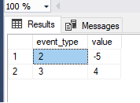
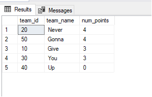

# Difficulty: EASY
## SqlEventsDelta

Given a table events with the following structure:
```sql
  create table events (
      event_type integer not null,
      value integer not null,
      time timestamp not null,
      unique(event_type, time)
  );
```

write an SQL query that, for each event_type that has been registered more than once, returns the difference between the latest (i.e. the most recent in terms of time) and the second latest value. The table should be ordered by event_type (in ascending order).

For example, given the following data:
```sql
   event_type | value      | time
  ------------+------------+--------------------
   2          | 5          | 2015-05-09 12:42:00
   4          | -42        | 2015-05-09 13:19:57
   2          | 2          | 2015-05-09 14:48:30
   2          | 7          | 2015-05-09 12:54:39
   3          | 16         | 2015-05-09 13:19:57
   3          | 20         | 2015-05-09 15:01:09

```

your query should return the following rowset:
```sql
   event_type | value
  ------------+-----------
   2          | -5
   3          | 4
```

For the event_type 2, the latest value is 2 and the second latest value is 7, so the difference between them is −5.

The names of the columns in the rowset don't matter, but their order does.


🟢SOLUTION:
I resolved it with a subquery using the lead function 
```sql
SELECT t1.event_type, t1.value - t1.prev_value as value
FROM (
     SELECT t.event_type,
            t.value,
            lead(t.value) over (partition by t.event_type order by time desc) AS prev_value,
            row_number() over (partition by t.event_type order by time desc) AS rn
       FROM events AS t) AS t1
WHERE rn=1 and prev_value is not null
ORDER BY event_type;
```


# Difficulty: MEDIUM
## SqlWorldCup
You are given two tables, teams and matches, with the following structures:
```sql
 create table teams (
      team_id integer not null,
      team_name varchar(30) not null,
      unique(team_id)
  );

  create table matches (
      match_id integer not null,
      host_team integer not null,
      guest_team integer not null,
      host_goals integer not null,
      guest_goals integer not null,
      unique(match_id)
  );
```
 
Each record in the table teams represents a single soccer team. Each record in the table matches represents a finished match between two teams. Teams (host_team, guest_team) are represented by their IDs in the teams table (team_id). No team plays a match against itself. You know the result of each match (that is, the number of goals scored by each team).

You would like to compute the total number of points each team has scored after all the matches described in the table. The scoring rules are as follows:

If a team wins a match (scores strictly more goals than the other team), it receives three points.
If a team draws a match (scores exactly the same number of goals as the opponent), it receives one point.
If a team loses a match (scores fewer goals than the opponent), it receives no points.
Write an SQL query that returns a ranking of all teams (team_id) described in the table teams. For each team you should provide its name and the number of points it received after all described matches (num_points). The table should be ordered by num_points (in decreasing order). In case of a tie, order the rows by team_id (in increasing order).

For example, for:
 teams:
 ```sql
  team_id | team_name
  ---------+---------------
   10      | Give
   20      | Never
   30      | You
   40      | Up
   50      | Gonna
```
matches:

```sql

   match_id | host_team | guest_team | host_goals | guest_goals
  ----------+-----------+------------+------------+-------------
   1        | 30        | 20         | 1          | 0
   2        | 10        | 20         | 1          | 2
   3        | 20        | 50         | 2          | 2
   4        | 10        | 30         | 1          | 0
   5        | 30        | 50         | 0          | 1
   
```
your query should return:
```sql
   team_id | team_name | num_points
  ---------+-----------+------------
   20      | Never     | 4
   50      | Gonna     | 4
   10      | Give      | 3
   30      | You       | 3
   40      | Up        | 0

```

🟢SOLUTION:
Here I used the Common table expresion (CTE) WITH and the Coalesce function to handle NULL values.

```sql
WITH team_points AS(
	SELECT host_team AS team_id,
	CASE	WHEN host_goals > guest_goals THEN 3
			WHEN host_goals = guest_goals THEN 1
			WHEN host_goals < guest_goals THEN 0
			END AS num_points
	FROM matches

UNION
	SELECT guest_team AS team_id,
	CASE	WHEN host_goals < guest_goals THEN 3
			WHEN host_goals = guest_goals THEN 1
			WHEN host_goals > guest_goals THEN 0
			END AS num_points
	FROM matches)

SELECT	t.team_id, 
		t.team_name,
		COALESCE(SUM(p.num_points),0) AS num_points		
FROM teams AS t
LEFT JOIN
team_points AS p 
ON p.team_id = t.team_id
GROUP BY t.team_id, t.team_name
ORDER BY num_points DESC, team_id 
	;

```


